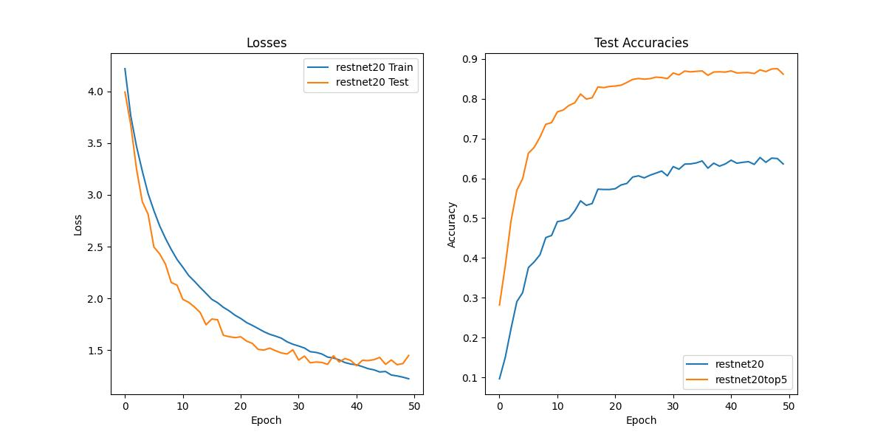
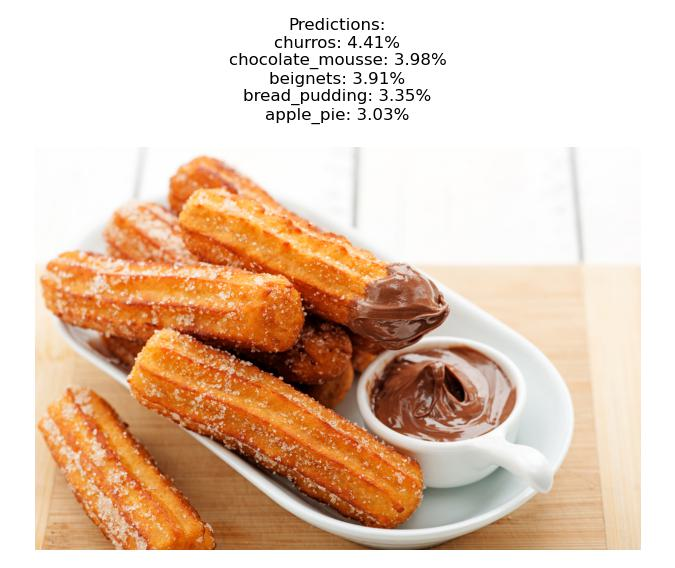

## I. Personal Information

Matriculation Number: 123...
Full Name: Henrik Norderhus

## II. Assignment overview

In this assignment, our main objective is to build a modular architecture using PyTorch that offers versatility and adaptability for various model variations. By utilizing this approach, we can expedite the development and experimentation process while showcasing the convenience and flexibility provided by PyTorch for designing new models.

Throughout the assignment, we will be focusing specifically on creating the ResNet architecture. ResNet, short for "Residual Network," is a popular deep learning architecture known for its ability to effectively train very deep neural networks.

The repository contains the necessary code to create and train modular ResNet models. Additionally it contains an inference script that runs on a custom input image, giving the five most likely classes. 

### III. ResNet results

| Model    | Train Losses | Test Losses | Test Accuracies | Test Top5 Accuracies |
|----------|--------------|-------------|-----------------|----------------------|
| ResNet8  | 1.541072     | 1.507691    | 0.614           | 0.847                |
| ResNet14 | 1.327248     | 1.417585    | 0.635           | 0.865                |
| ResNet20 | 1.224274     | 1.449048    | 0.636           | 0.861                |

Overall, the architectures performed well. Below a screenshot of the ResNet20 plots.



### IV. Running inference

To run the food recognition on the inference, call the script as such

```
python inference.py --model MODEL --weights path/to/weights.pth --image path/to/image.jpg --class_file path/to/class_file.txt
```

It will show the input image with the five most probable classes in the title, as seen below 


